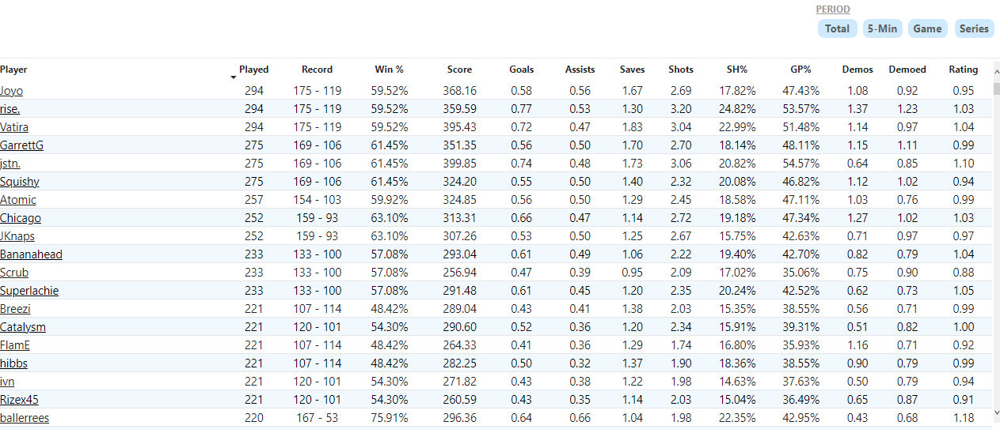

Introduction
----------------------------------------------------------------------------------------------------------------------------------------------------------------------

Rocket League is a vehicular soccer video game developed and published by Psyonix. The game was first released for Microsoft Windows and PlayStation 4 in July 2015, with ports for Xbox One and Nintendo Switch being released later on.

Described as "soccer, but with rocket-powered cars", Rocket League has up to eight players assigned to each of the two teams, using rocket-powered vehicles to hit a ball into their opponent's goal and score points over the course of a match. The game includes single-player and multiplayer modes that can be played both locally and online, including cross-platform play between all versions. Later updates for the game enabled the ability to modify core rules and added new game modes, including ones based on ice hockey and basketball.

[…]

Rocket League was praised for its gameplay improvements over Battle-Cars, as well as its graphics and overall presentation, although some criticism was directed towards the game's physics engine. The game earned a number of industry awards, and saw over 10 million sales and 40 million players by the beginning of 2018. Rocket League has also been adopted as an esport, with professional players participating through ESL and Major League Gaming along with Psyonix's own Rocket League Championship Series (RLCS). […]

----------------------------------------------------------------------------------------------------------------------------------------------------------------------
The datasets present Rocket League Championship Series 2021-2022 available data, for every single one region around the world ([EU] Europe, [NA] North America, [SAM] South America, [OCE] Oceania, [MENA] Middle East & North Africa, [APAC] Asia Pacific North/South and [SSA] Sub-Saharan African), including International Majors (Tiebreaker Match and APAC Qualifiers included) and the World Championship.

All information available with these datasets was obtained using both octane.gg and ballchasing.com APIs and cover the following events (pending data availability*):

- Fall Split
  1. Regionals 1, 2, 3 (All regions - Invitational Qualifiers, Closed Qualifiers and Main Events)
  2. Fall Major - Asia-Pacific Qualifier
  3. Fall Major - North America Tiebreaker (Complexity Gaming vs. Spacestation Gaming)
  4. Fall Major - Main Event
- Winter Split
  1. Regionals 1, 2, 3 (All regions - Closed Qualifiers and Main Events)
  2. Winter Major - Asia-Pacific Qualifier
  3. Winter Major - Main Event

The work of the octane.gg team, where most of the information are coming from, is to parse RLCS data posted on ballchasing.com, which is using Saltie's carball library to decompile .replay files associated with each game of the season. If a game replay has not been uploaded to ballchasing.com or saved to be decompiled, then information (or a major part of them) associated with the game will not be available in datasets. That is why Open Qualifiers games are not in datasets, because these event phases are not covered enough by the community. Some information from Qualifiers and minor / new regions (OCE, SAM, MENA, APAC, SSA) could also be missing.

----------------------------------------------------------------------------------------------------------------------------------------------------------------------
Project Scope and Context
----------------------------------------------------------------------------------------------------------------------------------------------------------------------
Source: https://www.kaggle.com/datasets/dylanmonfret/rlcs-202122

The following dataset has been loaded, and transformed using dbt + snowflake and following the proven methodology of software engineering with version control, modularity, and CI/CD.

As it stands, the current model is roughly 565k+ rows of data following the current Rocket League season of 2021 – 2022 for the Fall and Winter split. Currently, Spring is underway with Worlds being held in Dallas around August.

The goal of the project was to create a framework to capture the Rankings and Stats of the professional eSports scene for Rocket League. I did have plans to create a dashboard with PowerBI, however, it requires the end user to have a license. I did search for another BI tool, but most either require a license or have short trial versions. Therefore, I’ve foregone the visualization piece and included screenshots of what I did develop (very preliminary) and if you wish to see the data in action, in its entirety, please visit: https://octane.gg/stats/players?mode=3&minGames=50&group=rlcs2122fall

Nevertheless, please see below the following DAG (Directed Acyclic Graph) which shows the modularity of the project and the final pieces that would give any analyst full capabilities to recreate this dashboard in their BI tool of choice.

Preliminary Dashboard (Screenshots)
-----------------------------------

Total Player Stats
------------------

Total Player 5-Min Stats
------------------

fct_events
----------

fct_matches
----------

fct_games
----------

int_game_boost
----------

int_game_movement
----------

int_game_positioning
----------

